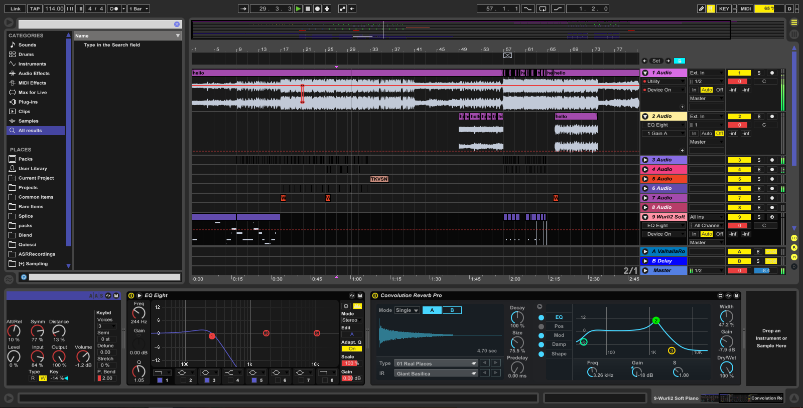

# RAW :white_large_square: :black_large_square:

A playful, minimalist skin for Ableton Live 8/9.




## Download

Download Live 9/8-format skin files (.ask) at [Releases](https://github.com/jczimm/RAW-skin/releases).

## Build for Yourself

```sh
npm install
chmod +x ./build
./build
```

The [./build](build) shell script will use the [json2ableton-live-skin](https://github.com/jczimm/json2ableton-live-skin) node module to create `RAW.ask` + `RAW-dark.ask` files (Live 9-format skin files) and `RAW-8.ask` + `RAW-dark-8.ask` files (Live 8-format skin files). These files are written into `dist/`.
