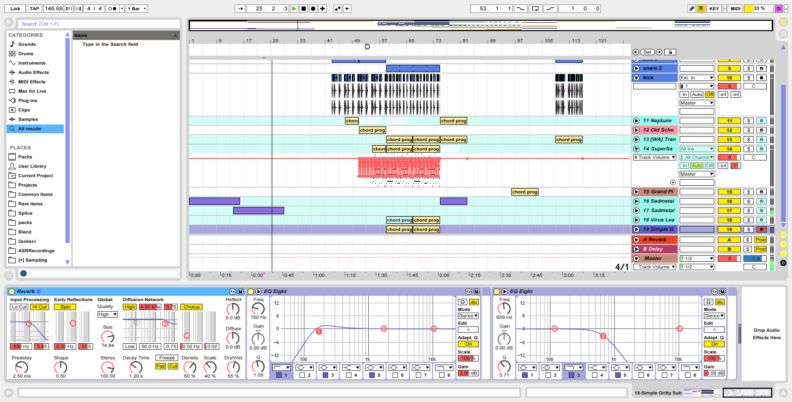

# RAW :white_large_square:

A playful, minimalist skin for Ableton Live 8/9.



## Download

Download a Live 9/8-format skin file (.ask) at [Releases](https://github.com/jczimm/RAW-skin/releases).

## Build for Yourself

The [build](build) shell script will install the npm dependency ([json2ableton-live-skin](https://github.com/jczimm/json2ableton-live-skin)) and use it to create a `RAW.ask` file (Live 9-format skin file) and a `RAW-8.ask` file (Live 8-format skin file).
```
chmod +x ./build
./build
```